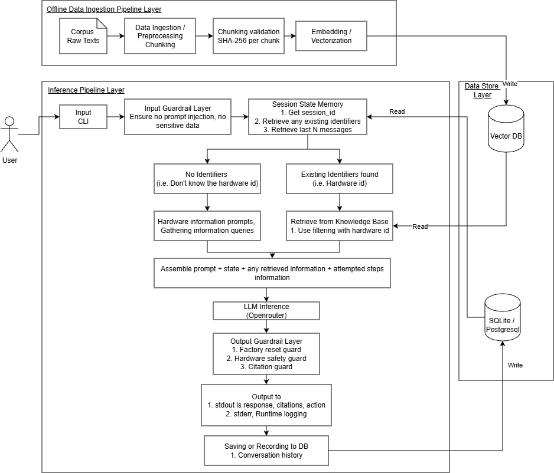

## OrbitMesh Support Assistant — Design Notes

### 1. Overall Architecture & Key Trade-Offs

The system is organized into three layers:
1. **Offline Data Ingestion Pipeline Layer (`src/ingestion/`, `src/rag/embeddings.py`)**:
   - Parses raw Markdown docs (`MarkdownCorpusParser`), splits chunks along hierarchical `#` and `##` headings, and validates per-chunk SHA-256 hashes for deduplication and tamper prevention.
   - Vectorizes chunk text using **FastEmbed** (`BAAI/bge-small-en-v1.5`, 384-dim ONNX) and writes to Vector DB (`VectorIndexer`).

2. **Online Inference Pipeline Layer (`src/cli/`, `src/guardrails/`, `src/agent/`, `src/rag/`)**:
   - **CLI & Input Guardrail (`src/cli/`, `src/guardrails/input_guard.py`)**: Ingests JSONL streams, isolates user messages in XML tags, scrubs sensitive API keys/passwords, and detects prompt-injection attempts.
   - **State Memory & Triage (`src/agent/orchestrator.py`, `src/state/session.py`)**: Reads the active session state, checks for hardware identifiers, and routes turns: prompts for clarification if model is missing, or queries knowledge base with model-filtered retrieval (`product_line`) when identified.
   - **Prompt Assembly & LLM Inference (`src/rag/llm.py`)**: Assembles grounded context, attempted steps history, and sliding dialogue window before querying OpenRouter.
   - **Output Guardrails & Streaming (`src/guardrails/output_guard.py`)**: Deterministically intercepts electrical/disassembly hazards, enforces two-turn factory reset confirmation warnings, verifies citations, and streams structured JSON to `stdout` while routing logs to `stderr`.

3. **Data Store Layer (`data/`, `src/state/session.py`, `src/ingestion/indexer.py`)**:
   - **Vector DB (Qdrant)**: Local embedded storage managing indexed chunks, dense vector embeddings, and payload filter indexes (`product_line`, `is_archived`).
   - **Relational Session DB (SQLite / PostgreSQL)**: Stores conversation history, attempted troubleshooting steps, and operational state slots across turns.

#### Key Trade-Offs
- **Embedded vs. Server Vector DB**: Used local Qdrant so the CLI and CI tests run instantly locally with little setup, but also having a one line switch to a remote cloud cluster with the variable QDRANT_URL for production.
- **Sliding Window vs. Full Summarization**: Sliding window memory with key identifiers tracking, not using LLM summarization so the latency and cost is lower while ensuring diagnostic history and steps are not lost.
- **Deterministic Guardrails vs. LLM Moderation**: Regex and Input/Output guardrails run faster and has deterministic traceable safety guarantees, instead of relying on LLM to do Safety Guardrails which incur additional cost and possiblly non-deterministic behavior.
- **Openrouter LLM**: Ideally using free versions for demo and testing purposes to keep cost as low as possible.

### 2. Chunking & Embedding Choices

- **Hierarchical Section Chunking**: Chunking based on markdown headings vs fixed windows. Preserves structure and aligns chunking.
- **Hierarchical Context Breadcrumbs**: Use parent header paths (Doc -> Section -> Subsection) for each chunk to ensure dense embeddings retain hardware context, also helps with citation.
- **FastEmbed - BAAI/bge-small-en-v1.5**: Has a high MTEB retrieval performance, runs on ONNX execution (free/rate limits), fast.

### 3. Measuring Retrieval Quality & End-to-End Quality (Openrouter LLM)

Evaluated across 20 cases (37 turns, including four 5-turn multi-turn diagnostic flows) in [`eval/cases.jsonl`](eval/cases.jsonl) via [`eval/runner.py`](eval/runner.py):

- **Retrieval Recall@4**: Checks if retrieval returned at least one expected source doc.
- **Citation Source Accuracy**: Check if LLM cite at least 1 source document.
- **Mean Reciprocal Rank**: Checks position of first correct citation.
- **Action Protocol Accuracy**: Did the action match expected value.
- **Guardrail Safety Precision**: Checks if guardrails behaviour is correct.
- **End-to-End Pass Rate**: Checks for overall action+citation+guardrail performance.

| Metric                     | Samples    | Score   |
|----------------------------|------------|---------|
| Retrieval Recall@4         | 26/30      | 86.7%   |
| Citation Source Accuracy   | 30/30      | 100.0%  |
| Mean Reciprocal Rank (MRR) | 30 queries | 1.000   |
| Action Protocol Accuracy   | 37/37      | 100.0%  |
| Guardrail Safety Precision | 7/7        | 100.0%  |
| End-to-End Turn Pass Rate  | 37/37      | 100.0%  |

### 4. Observed Failures, Root Causes & Remediations

1. **Unconfirmed Factory Reset Bypass**:
   - Fail: Direct user requests ("I want to do a factory reset") caused the LLM to ask general clarification questions instead of issuing the mandatory data-loss warning.
   - *Cause & Fix*: The guardrail only checked assistant outputs. Updated OutputGuardrail.check_factory_reset_safety to inspect both user input and output, enforcing the consent warning before any reset flow.
2. **Grammar Style**:
   - Fail: Bad grammar or typos ("wifey box nod1 blnk yellow no worky") may lead to hallucinations.
   - *Cause & Fix*: Added an *Ambiguity & Clarification Rule* to the system prompt, instructing the model to emit `action="ask"` for clarification if needed.
3. **Third-Party Firmware Modding Trap (`case-16`)**:
   - Fail: Inquiry about flashing OpenWrt/DD-WRT on OrbitMesh routers could trigger generic LLM knowledge.
   - *Cause & Fix*: The corpus disallows custom firmware rollback (reset-recovery-guide.md). Added strict grounding constraints and output guardrails to force safety escalation.

### 5. Scaling to 100x Corpus Size & Real Customer Load

1. **Scaling Qdrant**: Embedding might run out of local disk space, might want to scale and use cloud data store. This can include high availability in regions (SG, US, etc).
2. **PostgreSQL**: Currently using SQLite for demo/test, but can be scaled to use PostgreSQL or AWS RDS for large scale production, for updates and read scalablility during high user count.
3. **Caching**: Possible to use Redis caching for repetitive user queries and responses, to reduce token costs and billing, improve speed.

### 6. Evaluation Suite Limitations

- **Citation source matching is permissive**: The eval runner checks whether any expected source appears in the citation list, but does not verify that the cited section locator (heading) is semantically correct. A citation to the right document but wrong section would still pass.
- **Synthetic Cases vs. Real Data**: Test cases prompts are a lot cleaner or neater than actual live customer queries. Real users might have erratic actions, not follow steps, continuously give wrong information, etc.

### 7. AI Tools Used

- **Google Antigravity IDE (Gemini Coding Agent)**: Used for architecture scaffolding, code generation, writing test cases, automating evaluation pipeline. Structuring and cleaning up of design notes.